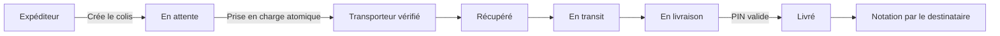

# Logistics

Plateforme web de gestion de livraisons au Maroc, construite avec **Laravel 13** et **React 18**.

Logistics met en relation expéditeurs, livreurs, voyageurs et destinataires dans un parcours complet : création d’un colis, attribution à un transporteur vérifié, suivi des statuts, confirmation par PIN, notation et support administratif.

> Projet portfolio full-stack — API REST Laravel, authentification Sanctum et interface React responsive.

[](https://laravel.com/)
[](https://react.dev/)
[](https://vite.dev/)
[](https://www.php.net/)
[](#tests-et-qualité)

## Fonctionnalités

### Expéditeur

- création d’expéditions avec estimation et informations du destinataire ;
- génération d’un identifiant de suivi et d’un PIN de livraison ;
- tableau de bord, statistiques et historique des statuts ;
- consultation des expéditions et création de tickets support.

### Livreur

- inscription avec informations d’identité, permis et véhicule ;
- validation du compte par un administrateur ;
- disponibilité en ligne et consultation des colis de sa ville ;
- prise en charge atomique d’un colis ;
- progression contrôlée des statuts et confirmation finale par PIN.

### Voyageur

- recherche de colis éligibles entre deux villes ;
- prise en charge d’une livraison sur un trajet compatible ;
- suivi des livraisons assignées.

### Destinataire

- consultation des colis associés à son numéro de téléphone ;
- suivi de livraison ;
- notation du transporteur après livraison.

### Administration

- statistiques globales ;
- validation ou rejet des transporteurs ;
- avertissement, suspension et bannissement ;
- gestion des colis et des tickets support.

## Parcours d’une livraison



## Architecture

```text
logistics/
├── backend-new/              API Laravel
│   ├── app/
│   │   ├── Http/Controllers  Auth, colis, tickets et administration
│   │   ├── Http/Middleware   rôles et état des comptes
│   │   └── Models            modèles Eloquent
│   ├── database/
│   │   ├── migrations        schéma SQLite
│   │   └── seeders           données de démonstration locales
│   ├── routes/api.php        routes REST
│   └── tests/                tests PHPUnit/Laravel
├── frontend/                 application React/Vite
│   └── src/
│       ├── components/       navigation et composants UI
│       ├── contexts/         authentification
│       ├── lib/api.js        client API et conversion camel/snake case
│       └── pages/            accueil et dashboards par rôle
├── LANCER_SITE.bat           lancement Windows simplifié
└── AUDIT_LOGISTICS_2026-08-12.md
```

## Stack technique

| Domaine | Technologies |
|---|---|
| Backend | PHP, Laravel 13, Eloquent, Laravel Sanctum |
| Frontend | React 18, Vite 6, Tailwind CSS 4 |
| UI | Radix UI, Lucide React, Recharts |
| Base de données | SQLite en environnement local |
| Tests | PHPUnit / Laravel Feature Tests |
| Sécurité | tokens Sanctum, contrôle des rôles, rate limiting, PIN haché |

## Sécurité intégrée

- PIN stocké sous forme de hash et révélé uniquement à la création du colis ;
- prise en charge transactionnelle empêchant deux transporteurs d’accepter le même colis ;
- transitions de statut contrôlées et retries idempotents ;
- blocage des tokens appartenant aux comptes suspendus ou bannis ;
- transporteurs obligatoirement vérifiés avant toute prise en charge ;
- réponses publiques limitées afin de ne pas exposer téléphone, nom ou adresse exacte ;
- validation et autorisation des tickets liés aux colis ;
- rate limiting sur la connexion, l’inscription, le suivi et la validation PIN ;
- timeout frontend sans retry automatique des mutations.

Le rapport détaillé est disponible dans [`AUDIT_LOGISTICS_2026-08-12.md`](./AUDIT_LOGISTICS_2026-08-12.md).

## Prérequis

- PHP `>= 8.3` ;
- Composer 2 ;
- Node.js et npm ;
- extension SQLite activée pour PHP ;
- Git pour cloner le projet.

## Installation manuelle

### 1. Cloner le dépôt

```powershell
git clone https://github.com/Seef590/logistics.git
cd logistics
```

### 2. Préparer le backend

```powershell
cd backend-new
composer install
Copy-Item .env.example .env
php artisan key:generate

if (-not (Test-Path database\database.sqlite)) {
    New-Item database\database.sqlite -ItemType File
}

php artisan migrate --seed
php artisan serve --host=127.0.0.1 --port=8000
```

Le backend est alors disponible sur : `http://127.0.0.1:8000`.

### 3. Préparer le frontend

Dans un second terminal :

```powershell
cd logistics\frontend
npm ci
Copy-Item .env.example .env
npm run dev -- --host 127.0.0.1 --port 5173
```

Ouvrir ensuite : `http://127.0.0.1:5173`.

## Lancement rapide sous Windows

Après clonage, il est également possible de lancer :

```powershell
.\LANCER_SITE.bat
```

Le script :

- crée les fichiers locaux manquants ;
- installe les dépendances si nécessaire ;
- préserve une clé Laravel déjà existante ;
- applique les migrations ;
- injecte les données de démonstration uniquement lors de la création d’une nouvelle base ;
- démarre le backend et le frontend dans deux terminaux.

## Démonstration locale

Après exécution du seeder, le suivi public peut être testé avec :

```text
LOG2024ABC
```

Les comptes de démonstration sont affichés par `LANCER_SITE.bat` et sur la page de connexion en mode développement. Ils sont destinés exclusivement à une installation locale et le seeder refuse de s’exécuter en production.

## Tests et qualité

### Backend

```powershell
cd backend-new
composer validate --strict
composer check-platform-reqs
php artisan test
composer audit
```

État de la suite au dernier audit :

```text
28 tests réussis
81 assertions
```

### Frontend

```powershell
cd frontend
npm audit
npm run build
```

État au dernier audit :

```text
npm audit : 0 vulnérabilité
Vite build : réussi
```

## Configuration

Les fichiers réels d’environnement ne doivent jamais être publiés :

```text
backend-new/.env
frontend/.env
```

Utiliser uniquement les modèles versionnés :

```text
backend-new/.env.example
frontend/.env.example
```

Variable frontend principale :

```env
VITE_API_URL=http://127.0.0.1:8000/api
```

## Limites connues et prochaines étapes

- mettre à jour les dépendances Composer signalées par `composer audit` avant tout déploiement public ;
- ajouter une vérification OTP/SMS de la propriété du numéro de téléphone ;
- séparer formellement l’état du paiement de celui de la livraison ;
- envisager des cookies HttpOnly pour une future authentification web en production ;
- découper progressivement le bundle frontend par route ;
- ajouter ESLint, un typecheck et des tests de composants frontend.

## Auteur

Développé par [Seef590](https://github.com/Seef590) comme projet full-stack de portfolio.

